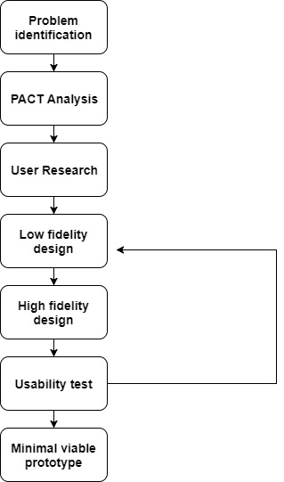
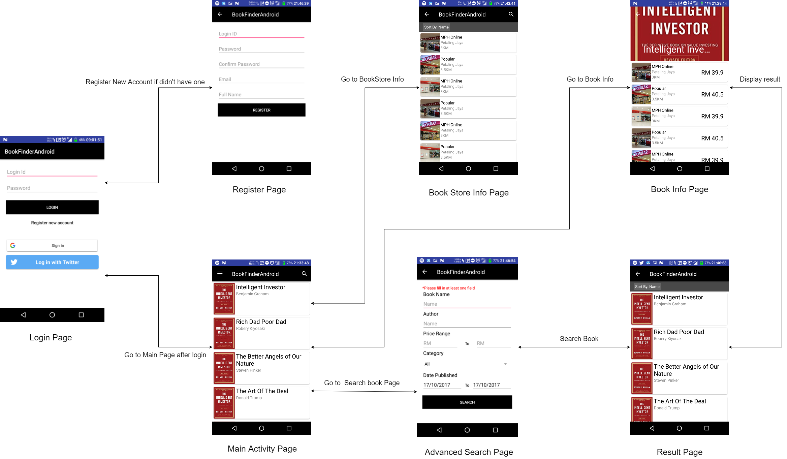
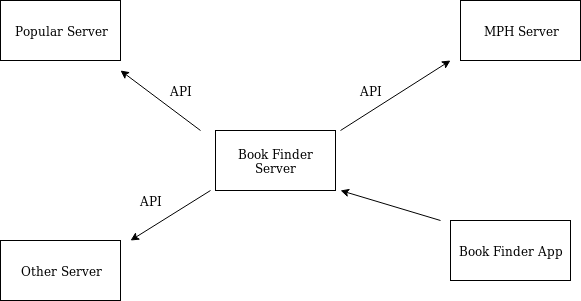

# Artifacts

## Table Of Contents

- [Life Cycle](Artifacts.md#life-cycle)

- [Problem Analysis](Artifacts.md#problem-analysis)

- [PACT Analysis](Artifacts.md#pact-analysis)

  * [People](Artifacts.md#people)

  * [Activities](Artifacts.md#activities)

  * [Context](Artifacts.md#context)

  * [Technology](Artifacts.md#technology)

- [User research](Artifacts.md#user-research)
 
  * [Online survey Test Run](Artifacts.md#online-survey-form)

    - [Observation from Test run](Artifacts.md#observation-from-test-run)

  * [Actual Online Survey](Artifacts.md#actual-survey)

    - [Observation from result](Artifacts.md#observation-from-result)

- [Design and Usability Testing](Artifacts.md#design-and-usability-testing)

- [Minimal Viable Prototype](Artifacts.md#minimal-viable-prototype)

- [Implementation](Artifacts.md#implementation)

## Life Cycle

*Life Cycle Diagram*

Life cycle diagram is a diagram that show the life cycle in a bigger picture. The general life cycle of this project started with problem Identification. In problem identification, we identify few problem area, and had decided to choose this book problem because books are most related to us in our daily life. We then move on to PACT analysis, where we try to identify few relevant information regarding to our project such as target market, technology, activities, context. 

The next stage is user research, where we analyze and validate our idea. This is the stage where we validate if people think the same as us, and if they face this issue in their real life. In this stage, we possible outcome could be receive, which is 

  1. The result are as if we expected, and hence we will be able to continue on with out project as we had validate our idea. Despite validate idea, it does not simple reflect that the project will be successful because people might face this problem but the solution might not be what they are looking for, or fail in marketing campaign, or many other factors. 

  2. Where the result doesn't reflect and support our idea.This is where we had to decide if we should continue with our project. We strongly believe that many of the time customer does not know what they want, but the solution might also be not what the customer want, hence decision had to be made in this stage. People who strongly believe in the idea and had experienced it might continue, meanwhile some of the people who half believe will give up at this stage. 

The next will be a cycle, where team sit down discuss about the UI design, and draw out low fidelity prototype on the spot. Designer then develop a high fidelity prototype by following the low fidelity prototype that result from the discussion and move on to usability test. After the userbility test, the feedback from the usability test will be used to improve the current prototype to make it become a better version of it. After a while, minimal viable prototype will be developed and then can move on to the next stage which is real implementation of functionality and backend. One important thing to note at this stage is that minimal viable prototype does not mean perfect, but rather a minimal version of the UI that able to market to the user and improve later on. In business, it is not practical to wait until a product to be perfect to only market to the public, because no revenue will be generate at that stage, but rather it should look for a minimal viable product and market it, and improve from the minimal viable product after the product had been publicly available and feedback had colelcted from mass public. 

## Problem Analysis

In Malaysia, there are a large numbers of bookstores everywhere ranging from Popular, MPH bookstore, etc. Each bookstore sell books at different prices. Despite numbers of bookstore around Malaysia, few problem had been faced. 

1. Difficult in locating the bookstore that sold a book at the cheapest price among all the bookstore.

1. Do not have a central platform for locating bookstores.

1. Unable to search availability of book in a central system

Bookstore located in various location of Malaysia, despite we can search the places of bookstore by using google, however some smaller bookstore might not be shown in the search result. Looking for cheapest book are also difficult as it need long amount of time in doing market research on each bookstore. Also, some of the book might not be available in some of the bookstore, and some book might not be even available in Malaysia, such as *Discourse on Inequality* by [Jean-Jacques Rousseau](https://en.wikipedia.org/wiki/Jean-Jacques_Rousseau), or *A Guide to the Good Life* by [William B. Irvine](http://www.wright.edu/~william.irvine/). 

## PACT Analysis

### People

- Student (Acedemic books)

- Whitecollar worker (Work related books)

- People who read book frequently (At least one book per year)

### Activities

- Help users to find books based on several criteria such as budget, category, etc

- Help users to locate available bookstore that in stock

- Redirect to the bookstore online website if prefer to buy online

- Help user to search for available bookstores

### Context

- Native Mobile app, because it is much more convinient for the user to be able to search a book when they are outside of their home or workplace. Despite web development are very robust today and much framework provide mobile friendly webapp, such as responsive web app, however it require higher skill sets, and require internet connection to access to the content. 

### Technology

1. Input
    - Search method
    - Book name - search by book
    - Budget and category - Search by category
    - GPS input location

1. Output
    - List of bookstore and website sorted by price

1. Communication
    - Server-client architecture query from database
    - Uses API from other platform

1. Content
    - Any user can update the outdated information

## User research

### Online survey Test Run

***Question***

  1. Age 

  1. Job 
      - Student
      - Lecturer
      - Doctor
      - Engineer
      - Other

  1. How often you read books?
      - Very rare
      - Once per month
      - Once per week
      - 3 times per week
      - 5 times per week
      - Everyday

  1. Average number of books you buy per year

  1. What are the types of book you normally read?
      - Philantrophy
      - Philosophy
      - IT
      - Finance
      - Business
      - Entrepreneurship
      - Novel
      - Other

  1. What are the reason you buy books?
      - Self enrichment
      - Work
      - Friend recommendation
      - Other

  1. Medium of buying books 
      - Physical bookstore
      - Online
      - Bookfair
      - Other

  1. Ever face problem in finding cheapest books
      - Yes
      - Neutral
      - No 

  1. How likely you will use a book finding app if there exist one 
      - Very likely
      - Likely
      - Neutral
      - Not likely
      - Very not likely

#### Observation from Test run

Each member of team will find a close friend, and let them do the test run of the question and observe from how they input and find ways to improve the question. Observation gain from the research - 

- Tend to give a range for averange number of books 

- Friend recommendation might be vague as for the reason of read books 

- Google form scale can be used for likelyhood of using app

### Actual Online Survey

***Improved question***

  1. Average number of books you buy per year
      - < 5
      - 5-10
      - 10-15
      - 15-20
      - 20-30
      - \> 30

  1. What are the reason you buy books?
      - Self enrichment
      - Work
      - Entertaiment
      - Other

  1. How likely you will use a book finding app if there exist one 
      - scale 1 - 10

The question distribute digitally through several medium, which include social media, blog, messaging app, etc. This is the [Result](Research.md) of the survey after being organized. The reason of distribute it through digital medium is because 

  1. Wide range of people who can answer to the survey

  1. People in any age might also read books, and our target market are huge, which basically anyone who buy books frequently, so we does not need to concern about who to answer the question 

  1. The size we capped it at 40, however the actual data collected is less than 40, because some prank answer are needed to filter out. Around 40 is more than enough for our case as we only focus on those who buy books frequently, hence it doesn't require to know what the mass think if the mass does not buy books frequently. 

Some prank data had been filter, such as meanwhile writing some irrelevant thign in some of the question that other option are provided or spam from the same google account. 

#### Observation from result

A rough summary on the key data - 

- 20/30 of the respondent age range between 18 - 25

- 14/30 of the respondent are Student

- 18/30 of the respondent has average frequency of reading book at least once per week.

- A positive corelation between frequency of reading books and average number of books buy per year

- 17/30 of the respondent uses physical bookstore as one of their medium to buy books

- 12/30 of the respondent uses online as one of their medium of buying books 

- 58.82% of the respondent who uses physical bookstore as one of their medium to buy book face problem in finding cheapest books to buy

- 35.3% of the respondent who uses physical bookstore as one of their medium to buy book are neutral in facing the problem of finding the cheapest books to buy

- 41.67% of the respondent who uses online as one of their medium to buy books face problem in finding the cheapest books to buy

- 33.33% of the respondent who uses online as one of their medium to buy books are neutral in facing the problem of finding the cheapest books to buy

A large number of respondent are student are most likely cause by the medium that used to distribute this survey, such as through some acedemic group or class group chat or even university confession page. 

Positive corelation between frequency of reading books and books buy per year are obviosu as they able to finish more books if the frequency of reading books are higher. 

From the observation, we can know that there are still a larger proportion of the poeple who buy books in physical store than buy it online. This could be because buying books in physical store allow them to preview to book content, perhaps read the introduction or even preface before buying the books. Also, some of the people might also shop around the bookstore to look for books to buy without a specific books in their mind. 

Also, majority of the respondent who buy books in physical store face problem when it comes to looking for the cheapest books to buy or at least feel neutral to the problem. This is believe that it is because respondent are require to travel to different bookstore to find out the price of the book meanwhile it is easier to find out online as they can just go to the bookstore website and find out the price immediately. 

What our app can do to user is that the user now not only can search for book price in a central repository, user can also easily find the nearest bookstore, and find the cheapest bookstore that sell the book which user want to buy. 

## Design and Usability Testing

For low fidelity, we choosed to use paint to draw because it can be found in every Microsoft Window computer, it is easy to use and also it doesn't need to be very nice as it is just a sketch of the design. 

As for high fidelity, we choose to do it in android studio and directly run it in real Android Phone. This is because several reason, which include 

  - Designer can experience it in real mobile phone

  - Some team member are experienced in doing android apps, hence more efficient and able to achieve more than using a stranger prototype software

  - Drag and drop, high simplicity

[Design 1](design/Design1.md)

[Design 2](design/Design2.md)

[Design 3](design/Design3.md)

## Minimal Viable Prototype

Here is an overview of the story board of our prototype.

## Implementation

The app can be implemented in a client server architecture, where the server store all the location of bookstores, price of books, book description, and other details. The server will also be very API centric, as it will frequently query the latest book price from the existing bookstore server if they have, and cache the information in local. Besides, user can also update the book price in the app, and later be approved by an admin and the detail will then be updated in the database. Block diagram will looks something like this. 

