# Design 1

## Table Of Contents

- [Low Fidelity](Design1.md#low-fidelity)

- [High Fidelity](Design1.md#high-fidelity)

- [Usability Testing](Design1.md#usability-testing)

  - [Usability Testing TODO](Design1.md#usability-testing-todo)

  - [Participant 1](Design1.md#participant-1)

  - [Participant 2](Design1.md#participant-2)

  - [Summary](Design1.md#summary)

## Low Fidelity

Low fidelity prototype is a rough sketch of the design in either hand drawn or drawn in simple tools like paint. Low fidelity is the rough output of the discussion between team member on the aspect of UI design. 

*Login Activity*

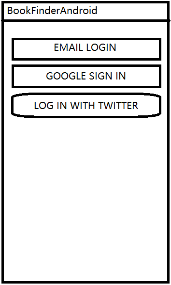

*Register Activity*

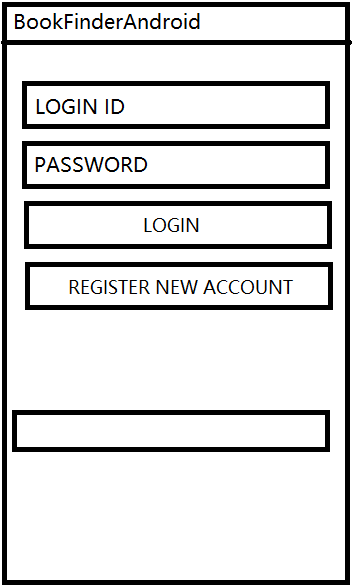

*Main Activity*

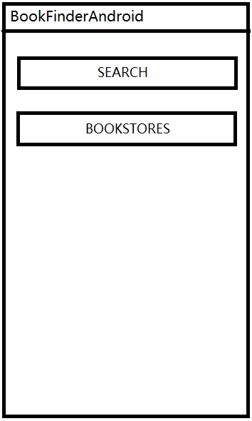

*Search Activity*

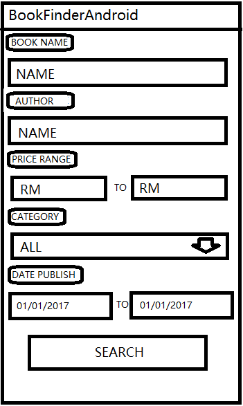

*Result Activity*

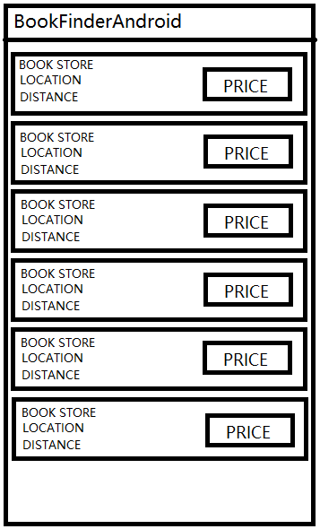

*Book Info Activity*

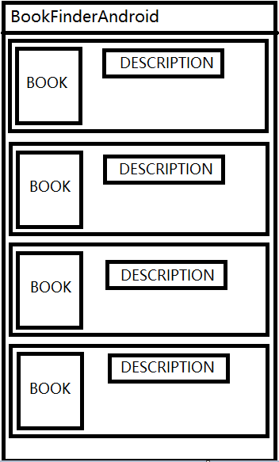

*Bookstore Activity*

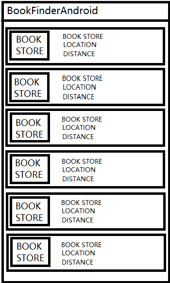

## High Fidelity

High Fidelity prototype is an mock up program that without actual functionality but only with UI design. The function of each UI component will be explain the below together while showing the screenshot. 

*Login Activity*

- Email login button - Navigate the user to email login activity

- Twitter/Google button - Login with using twitter or google account

*Email Login*

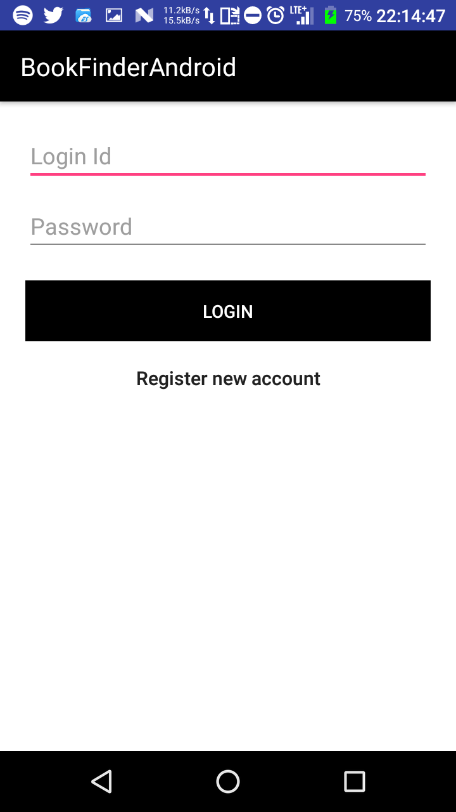

- Login ID/Password field - For user to enter their personal details

- Login button - For user to login with the details they had enter

- Register new account button - For user to register new account if they do not have any

*Register Activity*

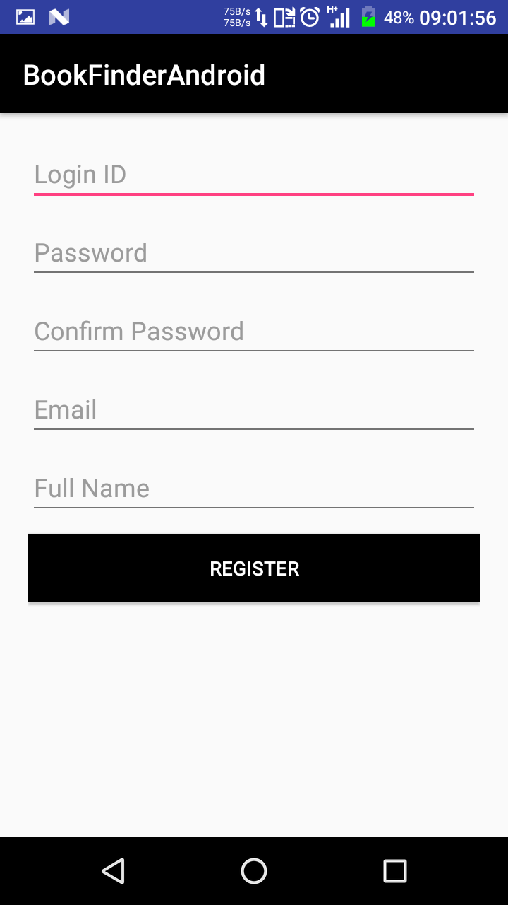

- Every input field - Input user personal details

- Register Button - For user to register

*Main Activity*

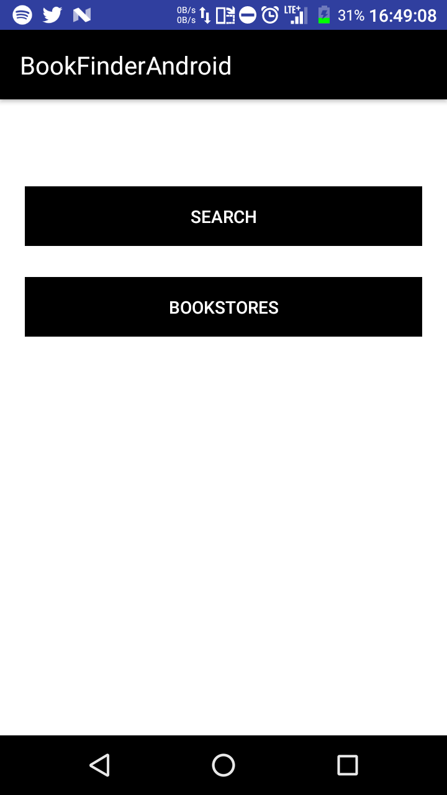

- Search button - Navigate to search books

- Bookstore button - Navigate user to look for list of bookstores

*Search Activity*

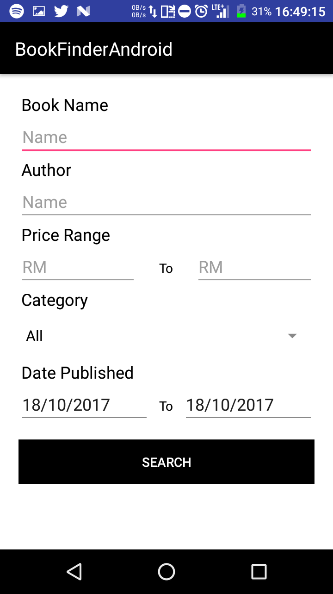

- Every input field - For user to input the respective book details they are looking for

- Search button - Search the book they are looking for

*Result Activity*

- Click into any result to see the description of book and bookstores

*Book Info Activity*

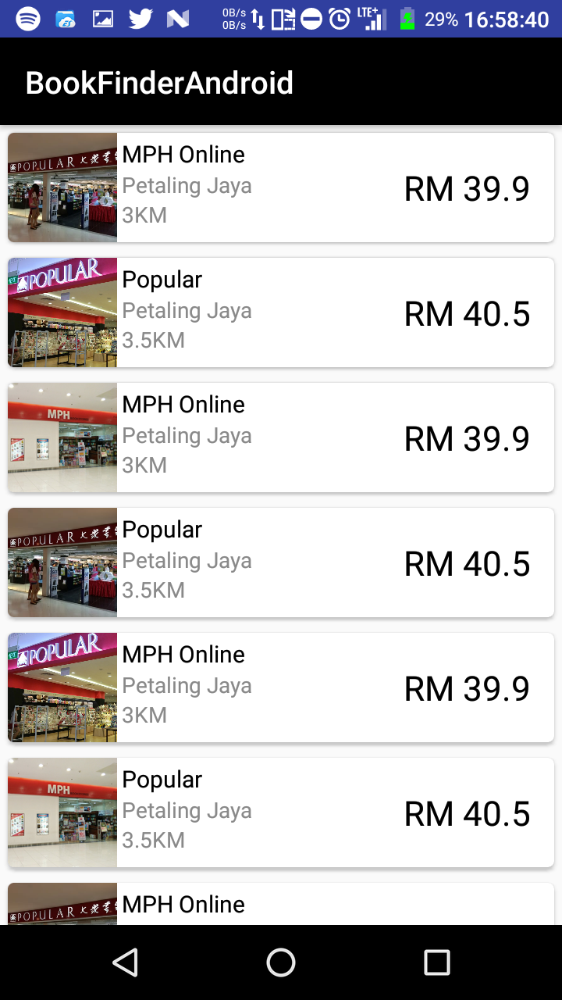

*Bookstore Activity*

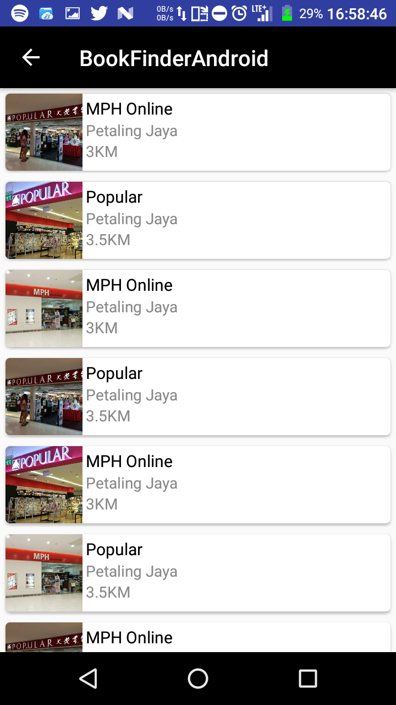

## Usability Testing

The usability testing for design one stop after only 2 participants as we realize the design are fill with tons of flaw to be improved, which is how we get to the next [design](Design2.md). Participant are asked to use the app, and think out loud with any thought they have. 

### Usability testing TODO

1. Try register account and login with email

1. Try to identify different login method and login

1. Identify the list of bookstore and look for the furtest bookstore and tell whr is it locate

1. Search for a book name *Intelligent Investor*

1. Identify the bookstore that sold at cheapest price

### Participant 1

1. Think the design of putting register in email login is weird

1. Able to identify different method 

1. Able to identify bookstores, but wish for a sort function

1. Able to use search, but suggest overwhelming option to just search a book that name are known

1. No problem in identifying bookstore that sold at cheapest price 

### Participant 2

1. Take a while to find register button and think could be better to put all together

1. Able to identify different method 

1. Able to identify bookstores

1. Doesn't know if he should fill in all field, or which field is required

1. No problem in identifying bookstore that sold at cheapest price, but hope if can take range into consideration

### Summary

1. Not user friend design for login page

1. Give more information to user when using search

1. Opt for sort, as user might need to sort by range instead of price

[Back to Artifacts](../Artifacts.md)