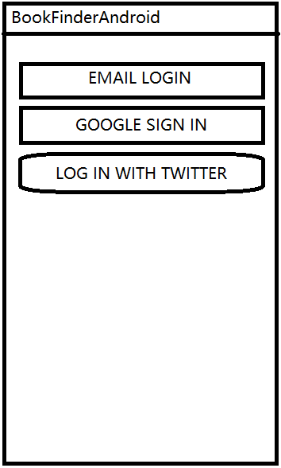
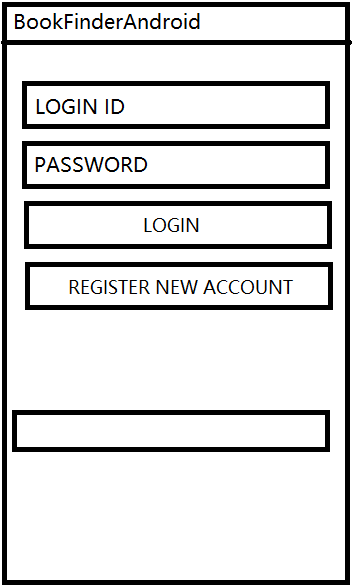
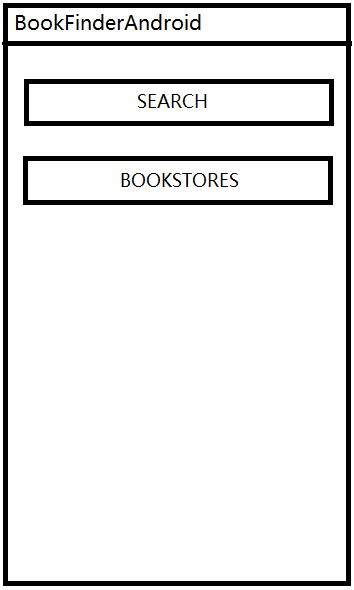
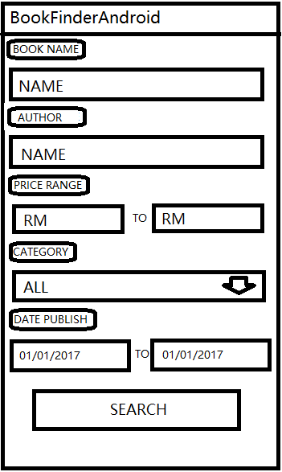
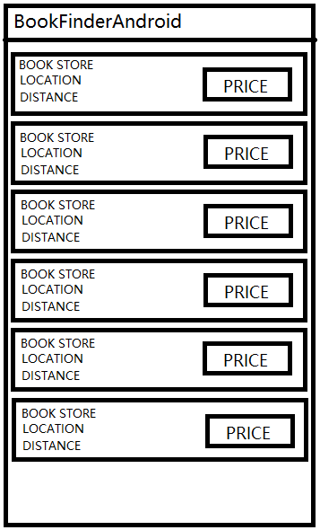
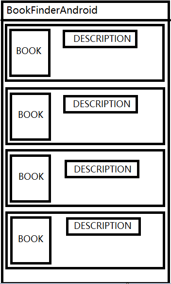
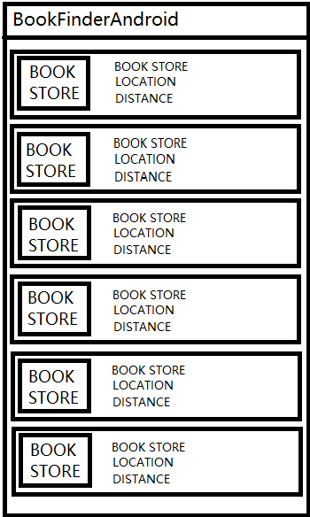

# Design 1

## Low Fedility

Low fedility prototype is a rough sketch of the design in either hand drawn or drawn in simple tools like paint. Low fedility is the rough output of the discussion between team member on the aspect of UI design. 

*Login Activity*

*Register Activity*

*Main Activity*

*Search Activity*

*Result Activity*

*Book Info Activity*

*Bookstore Activity*

## High Fedility

High Fedility prototype is an mock up program that without actual functionality but only with UI design. The function of each UI component will be explain the below together while showing the screenshot. 

*Login Activity*

- Email login button - Navigate the user to email login activity

- Twitter/Google button - Login with using twitter or google account

*Email Login*

- Login ID/Password field - For user to enter their personal details

- Login button - For user to login with the details they had enter

- Register new account button - For user to register new account if they do not have any

*Register Activity*

- Every input field - Input user personal details

- Register Button - For user to register

*Main Activity*

- Search button - Navigate to search books

- Bookstore button - Navigate user to look for list of bookstores

*Search Activity*

- Every input field - For user to input the respective book details they are looking for

- Search button - Search the book they are looking for

*Result Activity*

- Click into any result to see the description of book and bookstores

*Book Info Activity*

*Bookstore Activity*

