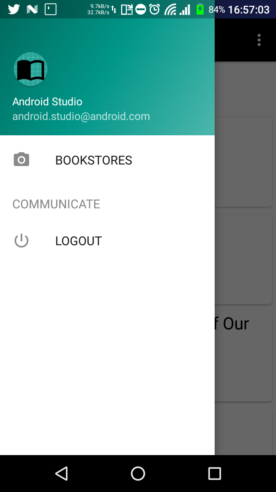

# Design 2

## Table Of Contents

- [Low Fidelity](Design2.md#low-fidelity)

- [High Fidelity](Design2.md#high-fidelity)

- [Usability Testing](Design2.md#usability-testing)

  - [Usability Testing TODO](Design2.md#usability-testing-todo)

  - [Participant 1](Design2.md#participant-1)

  - [Participant 2](Design2.md#participant-2)

  - [Participant 3](Design2.md#participant-3)

  - [Participant 4](Design2.md#participant-4)

  - [Participant 5](Design2.md#participant-5)

## Low Fidelity

As you might realize that the design of this low fidelity prototype are much more detail than [design 1](Design1.md). This is because when we designing low fidelity for [design 1](Design1.md), we still do not have any design in mind, meanwhile we already have a high fidelity prototype for [design 1](Design1.md) hence we draw a much more detailed low fidelity prototype. 

*Login Activity*

*Register Activity*

*Main Activity*

*Advance Search Activity*

*Result Activity*

*Book Info Activity*

*Bookstore Activity*

## High Fidelity

As this is the improved version of [design 1](Design1.md), many component remain same with [design 1](Design1.md), hence it will not be repeated for those component that still the same

*Login Activity*

- Input field - For user to input their personal detail

- Login button - Let user to login with the personal detail they had input

- Register new account button - Let user register new account with their personal detail

- Twitter/Google button - Login with using twitter or google account

*Main Activity*

- Search icon - Allow user to search book with book name only

- Advance search button - Allow more advance user to search book with more advance option

- Books - Result of the search

- Menu icon on top left - Let user to open the menu

*Main Activity Menu*

- Bookstore - Navigate to the bookstores activity

- Logout - Logout from current account

*Advance Search Activity*

- Improve with telling user fill in at least one field will be sufficient

*Result Activity*

- Added sort button at the top

*Book Info Activity*

- Improve to be more aesthetic with book image at toolbar

*Bookstore Activity*

- Added sort button at the top

## Usability Testing

The usability test are carry out smoothly interviewing 5 participants. Participant are asked to use the app, and think out loud with any thought they have. Improvement are done after collecting information from the feedback. The improved design are [Design 3](Design3.md).

### Usability testing TODO

1. Assume you are new user, try to register an account

1. Try to identify different login method and login

1. Locate the menu 

1. Identify the list of bookstore and look for the furtest bookstore and tell whr is it locate

1. By using search bar, try to search for a book and tell which bookstore is cheapest

1. Try to identify advance search and understand every single field

1. Try to sort the advance search result

### Participant 1

1. Participants know what each field for and where to look for register button

1. Participant able to login

1. Able to locate

1. Able to identify bookstore

1. Able to find search bar and locate the book, able to identify venue of bookstore and cheapest bookstore, having a bit trouble pressing advance search

1. Participant do not know how to go back, other than that no problem

1. No input

### Participant 2

1. Participants know what each field for and where to look for register button

1. Able to use social media to login

1. Able to locate

1. Able to identify

1. Unable to click the search bar, went to advance search

1. Able to understand all field

1. Able to sort

### Participant 3

1. No problem register an account

1. Able to login without problem

1. Able to find the menu

1. No problem finding the list of bookstore and the furthest bookstore

1. Try to click at the middle do not know need to click the search icon at first use

1. Able to understand every field in advance search

1. Able to understand how to use sort

### Participant 4

1. Able to register without problem

1. Able to login, identify different method of login

1. No problem locating menu

1. Able to identify different bookstore and the location and how far is it

1. Able to use search bar without problem

1. Able to understand every field of the advance search

1. Able to identify sorting

### Participant 5

1. Able to understand every register field

1. Able to identify different method of login

1. No problem

1. Able to identify the further bookstore

1. Able to know to click the search icon to search

1. Having problem to locate advance search button, probably too small, understand every single field

1. Able to identify the sort button