# Design 3

## Table Of Contents

- [Low Fidelity](Design3.md#low-fidelity)

- [High Fidelity](Design3.md#high-fidelity)

- [Usability Testing](Design3.md#usability-testing)

  - [Usability Testing TODO](Design3.md#usability-testing-todo)

  - [Participant 1](Design3.md#participant-1)

  - [Participant 2](Design3.md#participant-2)

  - [Participant 3](Design3.md#participant-3)

  - [Participant 4](Design3.md#participant-4)

  - [Participant 5](Design3.md#participant-5)

## Low Fidelity

Most of the improve in this design 3 are only added a back button as we realize mroe than one participants having problem with going back, which most likely to be iPhone users. Also we had improve the Main Activity.

*Register Activity*

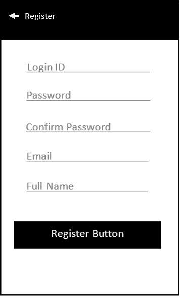

*Main Activity*

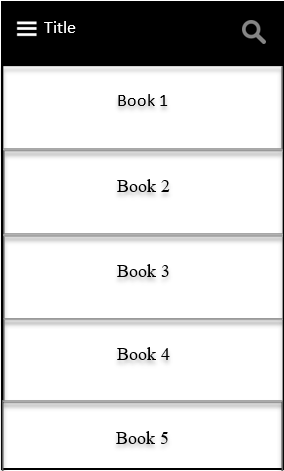

*Advance Search Activity*

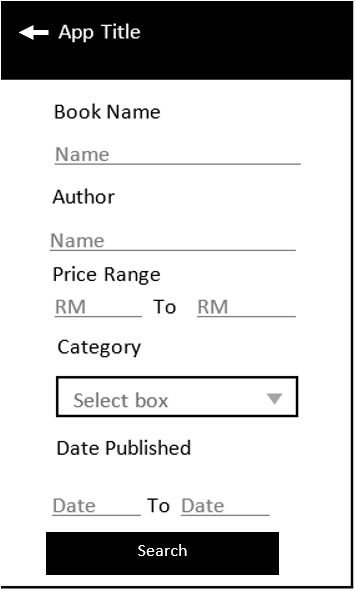

*Result Activity*

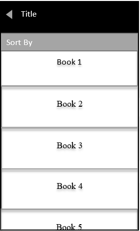

*Bookstore Activity*

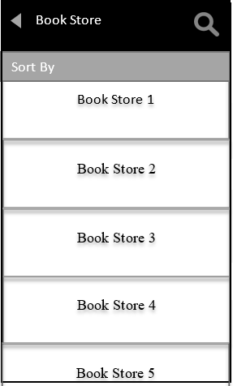

## High Fidelity

Most design are same from [design 2](Design2.md), with only minor changes. Changes will be stated.

*Register Activity*

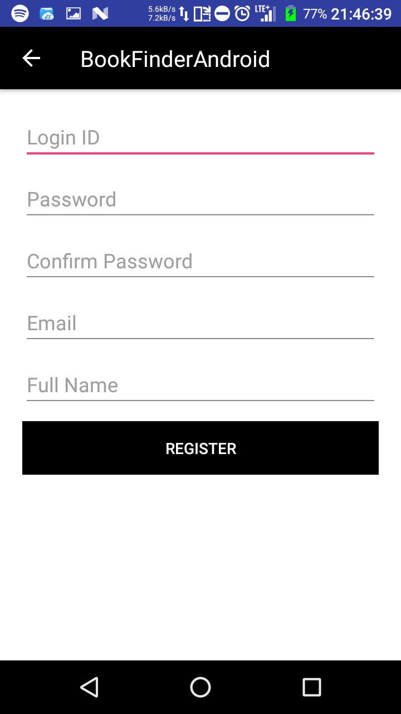

- Added back button on top left

*Main Activity*

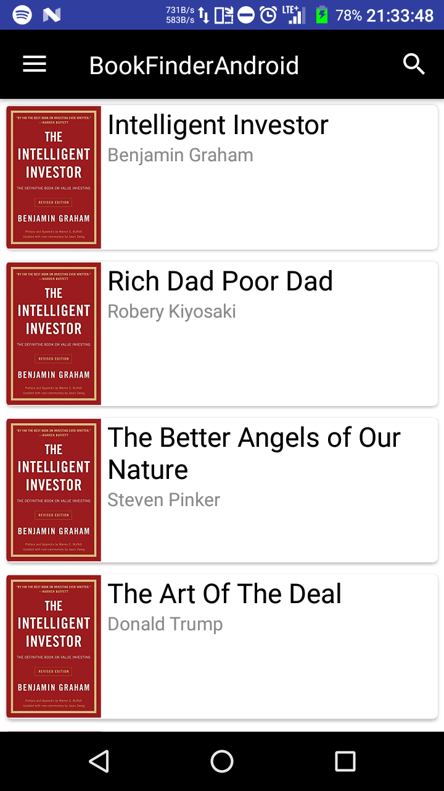

- Migrate search to top right

*Main Activity Menu*

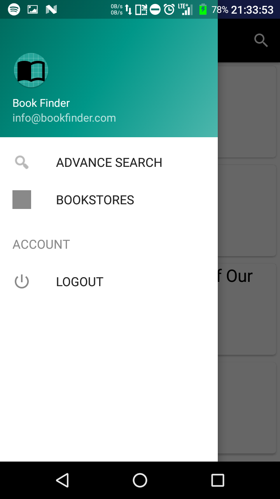

- Migrate Advance search to menu

*Advance Search Activity*

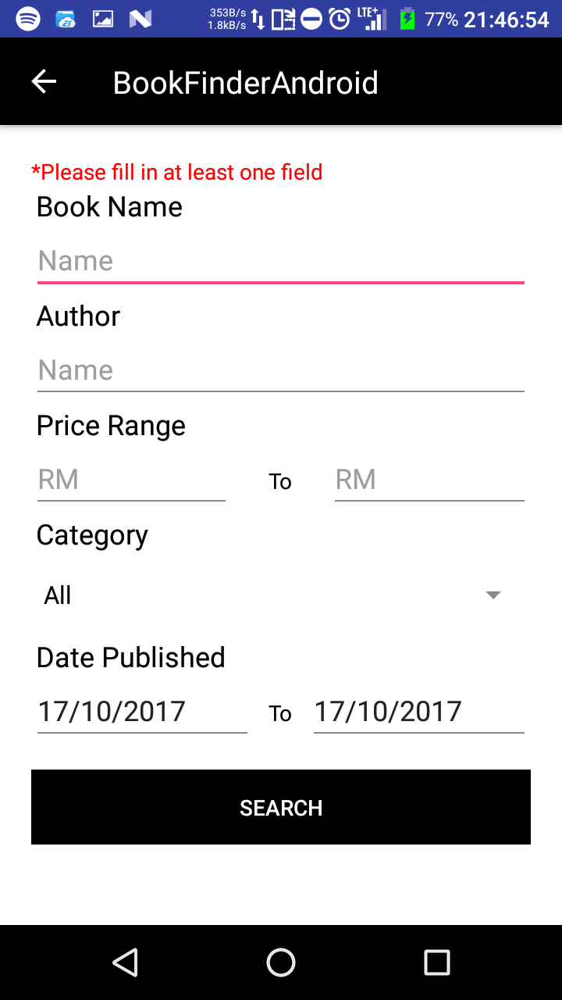

- Added back button on top left

*Result Activity*

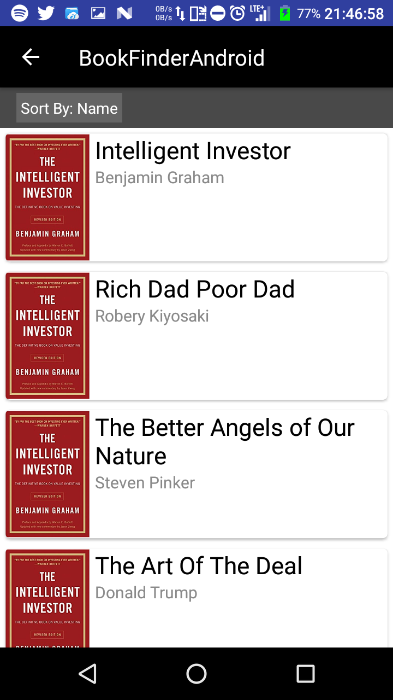

- Added back button on top left

*Bookstore Activity*

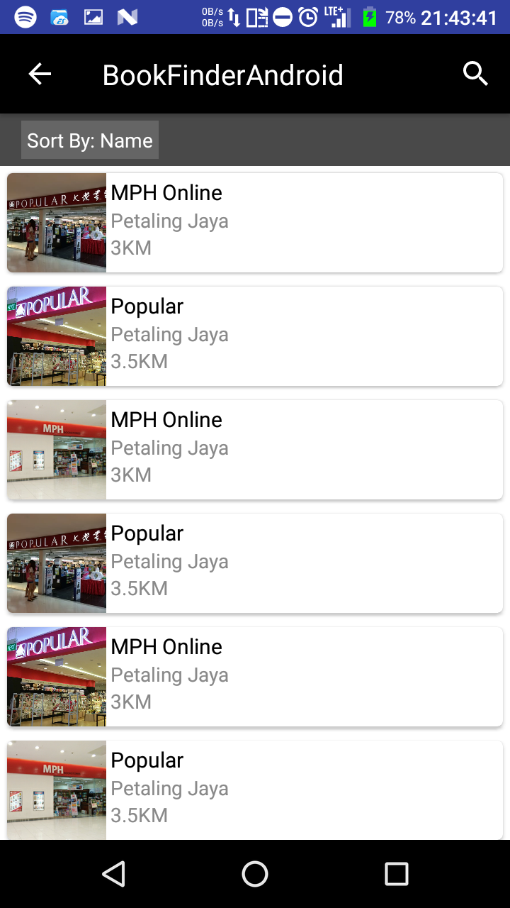

- Added back button on top left

## Usability Testing

The usability test are carry out smoothly interviewing 5 participants. Participant are asked to use the app, and think out loud with any thought they have. 

### Usability testing TODO

1. Try to search a book with name

1. Locate Advance search

### Participant 1

1. Able to identify search icon

1. Able to find advance search in menu

### Participant 2

1. Able to identify search icon and use in

1. Took a while, but not too long to locate advance search button, but suggest it is common practice

### Participant 3

1. Able to identify

1. Able to locate advance search button

### Participant 4

1. Able to identify

1. Able to locate

### Participant 5

1. No problem

1. Took a while, but not too long to locate